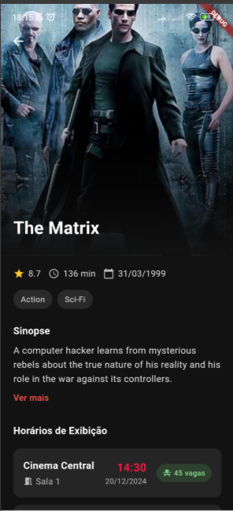
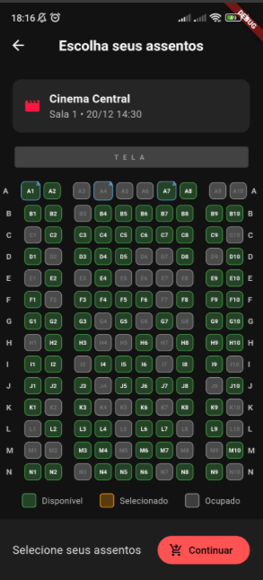
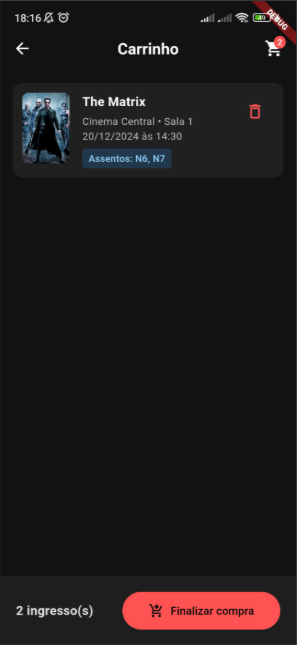

# CineTicket

App Flutter de compra de ingressos de cinema (listagem de filmes, sessões, assentos, carrinho e checkout simulado).

## Imagens do app


| Início | Detalhes do filme |
|:---:|:---:|
|  |  |

| Assentos | Carrinho |
|:---:|:---:|
|  |  |

| Pagamento | Comprovante |
|:---:|:---:|
|  |  |

---

## Requisitos

- [Flutter SDK](https://docs.flutter.dev/get-started/install) (Dart `>=3.4.0 <4.0.0`, ver `pubspec.yaml`)

## Como executar

```bash
flutter pub get
flutter run
```

## Testes

O projeto usa `flutter_test` e `bloc_test`. Repositórios reais são substituídos por **fakes** em `test/support/` onde necessário.

```bash
# Toda a suíte
flutter test

# Por área
flutter test test/modules/home/
flutter test test/modules/movie_details/
flutter test test/modules/seats/
flutter test test/modules/cart/
flutter test test/modules/checkout/
```

| Área        | Conteúdo principal |
|------------|---------------------|
| `home`     | `HomeBloc`, `HomePage` |
| `movie_details` | `MovieDetailsBloc`, `MovieDetailsPage` |
| `seats`    | `SeatsBloc`, `SeatSelectionPage` |
| `cart`     | `CartBloc`, `CartPage` |
| `checkout` | `PaymentConstants`, `PaymentPage`, `ReceiptPage` |

---

## Arquitetura (visão prática)

Estado de tela com **flutter_bloc**. Dados de exemplo vêm de **repositórios** em `lib/data/` e **mocks** em `lib/data/mocks/`. Injeção de dependências com **GetIt** (`lib/core/di/di.dart`). Navegação com `onGenerateRoute` (`lib/core/router/router.dart`).

### Fluxo de telas

```
Home ──► MovieDetails ──► SeatSelection ──► Cart ──► Payment ──► Receipt
  │                                              │        │         │
  └──────────────────────────────────────────────┘        │    ClearCart + volta ao Home
                                                            (AddToCart)
```

### Módulos em `lib/modules/`

| Pasta | Responsabilidade |
|-------|------------------|
| `home/` | Lista de filmes em cartaz (`HomeBloc`, `MovieRepository`) |
| `movie-details/` | Detalhes e horários (`MovieDetailsBloc`) |
| `seats/` | Mapa de assentos (`SeatsBloc`, `SeatRepository`) |
| `cart/` | Itens do pedido (`CartBloc`, estado em memória) |
| `checkout/` | Pagamento e comprovante (`PaymentPage`, `ReceiptPage`, `PaymentConstants`) |

Modelos compartilhados (`Movie`, `Showtime`, `Seat`, `CartItem`) ficam em **`lib/data/models/`**. Argumentos de rota (`ReceiptArgs`, `SeatSelectionArgs`) em **`lib/core/router/`**.

### Estrutura de pastas (`lib/`)

```
lib/
├── main.dart
├── core/
│   ├── di/           # GetIt — MovieRepository, SeatRepository, HomeBloc, CartBloc
│   ├── router/       # generateRoute, routes, receipt_args, seat_selection_args
│   ├── theme/        # AppColors
│   └── utils/        # formatadores (CPF, cartão), formatDateToBr, isValidCpf
├── data/
│   ├── movie_repository.dart
│   ├── seat_repository.dart
│   ├── models/       # movie, showtime, seat, cart_item
│   └── mocks/        # dados de demonstração
└── modules/
    ├── home/
    ├── movie-details/
    ├── seats/
    ├── cart/
    └── checkout/
```

---

## Dependências principais

- `flutter_bloc` — estado
- `equatable` — igualdade de estados/eventos
- `get_it` — DI
- `intl` — datas e moeda (pt_BR)

---

## Documentação Flutter

- [Documentação Flutter](https://docs.flutter.dev/)
- [Testes](https://docs.flutter.dev/testing)

---

## Autor

Desenvolvido por [leandrolima132](https://github.com/leandrolima132)
